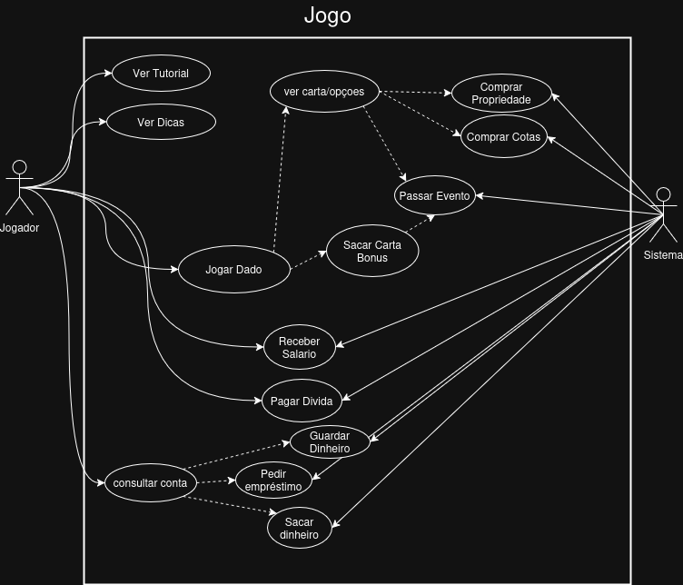
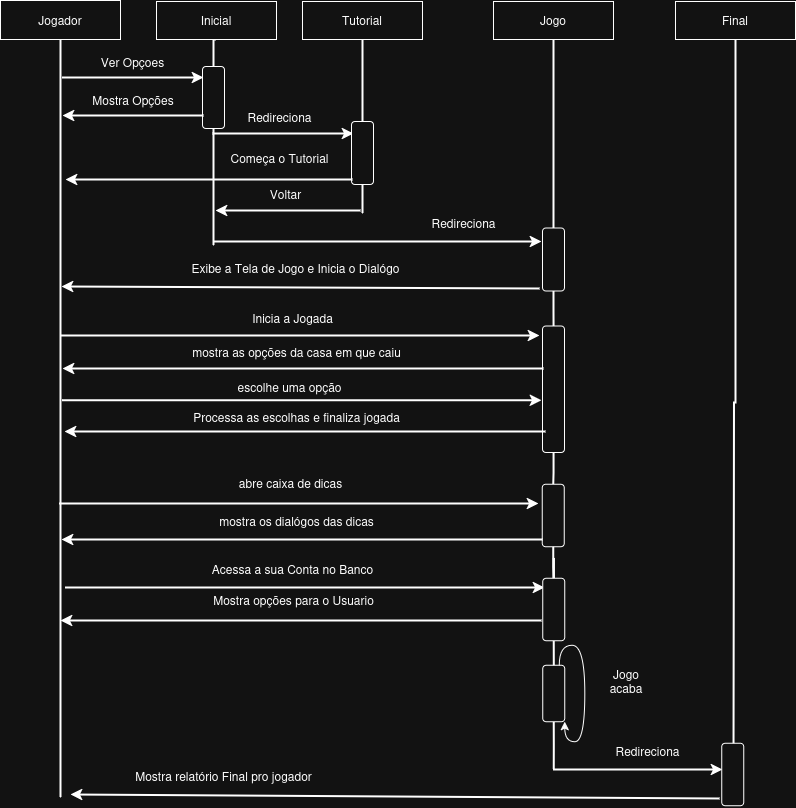
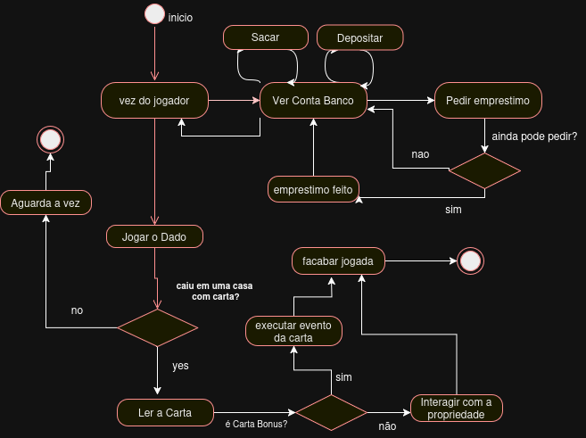
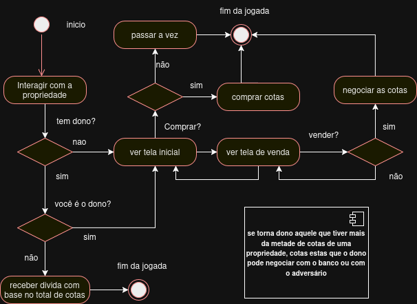

# Jogo de Educação Financeira Banco Imobiliario
* author: @JONAS_SL
_______________________________________________

## Resumo
        O jogo banco imobiliário se resume a uma dinâmica em um tabuleiro
    com dados e cartas para comprar imóveis e propriedades com dinheiro
    ganho dentro do jogo, os elementos desta dinâmica foram usados para gamificar
    uma maneira de se ensinar enducação financeira para adolescentes cursando
    o 8º e 9º ano do ensino fundamental II (público alvo) de maneira lúdica
    equilibrando diversão com responsabilidades financeiras e conhecimento
        Os principais Conteudos Abordados Serão a respeitos de matemática 
    financeira Da BNCC nestas séries dos anos finais as quais são: juros compostos,
    montante, taxa de juros.
        Outros conteúdos relacionados ao mesmo escopo de educação financeira serão
    abordados, estes conteúdos são: Reserva de emergencia, Ativos e Passivos, Fundos
    imobiliários, Inflação e Controle de Dívidas

_______________________________________________

## Diagrama de Casos de Uso

## Diagrama de Sequencia

## Diagrama de Atividades, escopo geral

## Diagrama de Atividades, escopo das cartas

[Link pro protótipo no figma](https://www.figma.com/design/1ZqToWNni79YQuaJudrlLu/Jogo-do-banco-Imobilario?node-id=0-1&t=A38d9BysGKyVixUv-1)

[Link pro template no Engaged](https://docs.google.com/document/d/1PoYMowO57KqJXd2PIGKLjQapXWg-2SflWNqnVqUFat4/edit?usp=sharing)